

  Supervised by Takehisa Yairi, Naoya Takeishi

---
maxDepth: 2
---

  <Toc depth="2" />

---
layout: section
subject: Overview
---

# Overview

---
layout: default
headerEnable: true
headerTitle: Overview
headerLogo: figures/utokyo.png
---

## 本研究の貢献
ダイナミクスが確率微分方程式(SDE)に従う系においてモデルフリーで系の連続性を学習に組み込む強化学習(RL)を提案した。

<v-clicks>

<strong>強化学習 (RL)</strong> 
- <strong class="accent">機械学習の一種で, 最適な行動戦略を学習する。</strong>ロボットの制御, LLMのチューニングなどで使われる。 
- 基本的には<strong class="accent">離散的な状態遷移</strong>を行う系上での最適化問題として定式化される。 

<figure style="position: absolute; top: 59%; right: 60%; width: 250px; text-align: center;">
  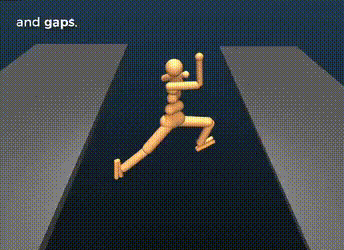
  <figcaption style="font-size: 1.2em; word-wrap: break-word; margin-top: 4px;">
    強化学習の学習プロセス
  </figcaption>
</figure>

<strong>確率微分方程式 (SDE)</strong> 
- 時間発展にノイズが乗った微分方程式

<figure style="position: absolute; top: 59%; right: 20%; width: 300px; text-align: center;">
  
  <figcaption style="font-size: 1.2em; word-wrap: break-word; margin-top: -6px;">
    SDEのサンプルパス
  </figcaption>
</figure>

</v-clicks>

<strong>強化学習 (RL)</strong> 
- <strong class="accent">機械学習の一種で, 最適な行動戦略を学習する。</strong>ロボットの制御, LLMのチューニングなどで使われる。 
- 基本的には<strong class="accent">離散的な状態遷移</strong>を行う系上での最適化問題として定式化される。 
<strong>確率微分方程式 (SDE)</strong> 
- 時間発展にノイズが乗った微分方程式

  

  <strong>本研究の位置づけ</strong> 
  確率最適制御と強化学習を結ぶ研究。確率最適制御の目標であるHJB方程式を, 強化学習と同様にモデル未知でデータドリブンで解く手法を提案した。
  

<v-click>

<strong>先行研究からの差分</strong> 
先行研究では学習のためにモデルを必要としていたため振り子のような簡単な系での実験にとどまっていたが, 本研究では初めてモデルフリーの手法を提案し強化学習の一般的なベンチマークで性能を確かめた。

</v-click>

---
layout: two-cols
headerEnable: true
headerTitle: Overview
headerLogo: figures/utokyo.png
---

## Motivation

::left::
**強化学習の枠組み**

  

    

      

        

          <v-click>
            <figure style="position: absolute; top: 30%; left: 8%; width: 350px; text-align: center;">
              
              <figcaption style="font-size: 0.8em; text-align: center; width: 200px; position: absolute; top: 102%; left: 20%;">
              Markov Decision Process (MDP)
              </figcaption>
            </figure>
          </v-click>
        

        

          <figure style="position: absolute; top: 30%; left: 8%; width: 350px; text-align: center;">
            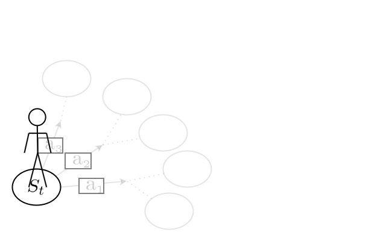
            <figcaption style="font-size: 0.8em; text-align: center; width: 200px; position: absolute; top: 102%; left: 20%;">
            Markov Decision Process (MDP)
            </figcaption>
          </figure>
        

      

      

        <figure style="position: absolute; top: 30%; left: 8%; width: 350px; text-align: center;">
            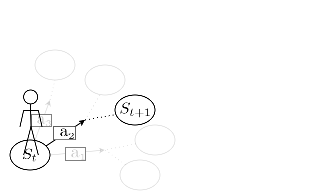
            <figcaption style="font-size: 0.8em; text-align: center; width: 200px; position: absolute; top: 102%; left: 20%;">
            Markov Decision Process (MDP)
            </figcaption>
        </figure>
      

    

    

        <figure style="position: absolute; top: 30%; left: 8%; width: 350px; text-align: center;">
        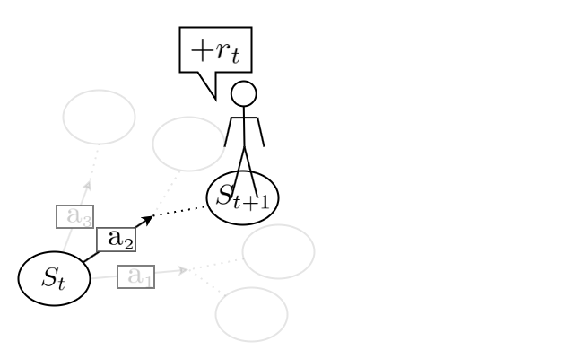
        <figcaption style="font-size: 0.8em; text-align: center; width: 200px; position: absolute; top: 102%; left: 20%;">
        Markov Decision Process (MDP)
        </figcaption>
        </figure>
    

  

  

    <figure style="position: absolute; top: 30%; left: 8%; width: 350px; text-align: center;">
      
      <figcaption style="font-size: 0.8em; text-align: center; width: 200px; position: absolute; top: 102%; left: 20%;">
      Markov Decision Process (MDP)
      </figcaption>
    </figure>
  

  <figure style="position: absolute; top: 30%; left: 8%; width: 350px; text-align: center;">
      
      <figcaption style="font-size: 0.8em; text-align: center; width: 200px; position: absolute; top: 102%; left: 20%;">
      Markov Decision Process (MDP)
      </figcaption>
  </figure>

<v-click>
<figure style="position: absolute; top: 25%; left: 5%; width: 150px; text-align: center;">
  
</figure>
</v-click>

<v-click>
<figure style="position: absolute; top: 76%; left: 12%; width: 200px; text-align: center;">
  
  <figcaption style="font-size: 0.8em; white-space: nowrap;">
    <strong>Model: Transition Probability Matrix</strong>
  </figcaption>
</figure>
</v-click>

::right::

**Real-World Dynamics**

<v-click>
<figure style="position: absolute; top: 25%; left: 55%; width: 90px; text-align: center;">
  
</figure>
</v-click>

<v-click>
<figure style="position: absolute; top: 40%; left: 62.5%; width: 220px; text-align: center;">
  
  <figcaption style="font-size: 0.8em; text-align: center; width: 200px; position: absolute; top: 102%; left: 10%;">
    Controlled Diffusion Process
    </figcaption>
</figure>
</v-click>

<v-click>
<figure style="position: absolute; top: 77%; left: 62%; width: 250px; text-align: center;">
  
  <figcaption style="font-size: 0.8em; white-space: nowrap;">
    <strong>Model: &mu;, &sigma;</strong>
  </figcaption>
</figure>
</v-click>

    <v-click>
    

    

    

    Can we formulate RL within the framework of this system?
    

    </v-click>

  <figure style="position: absolute; top: 48%; left: 46%; width: 80px; text-align: center;">
    
  </figure>

<v-click>
<Arrow :x1="600" :y1="435" :x2="369" :y2="471.75" :width="3" class="text-red-500" />
  <svg width="800" height="600" style="position: absolute; top: 0; left: 0; pointer-events: none;">
    <text
        x="487.49"
        y="436.70"
        transform="rotate(-9, 487.49, 436.70)"
        text-anchor="middle"
        dominant-baseline="central"
        font-size="4"
        fill="red"
    >
        変換できる*
    </text>
  </svg>
  

    *In continuous time, the object being transformed is the infinitesimal generator, not the transition probability matrix.  The RL framework still applies in the same way.
  

</v-click>

<v-clicks>
  

    &rArr; 従来の強化学習をそのまま適用できる。
  

  

    &rArr; 離散でも連続でも共通で使えるということは, 連続の 系に特有の情報を活用できていない。
  

</v-clicks>

---
layout: default
headerEnable: true
headerTitle: Overview
headerLogo: figures/utokyo.png
---

## 研究概要

  

  <figure style="position: absolute; top: 18%; left: 5%; width: 300px; text-align: center;">
    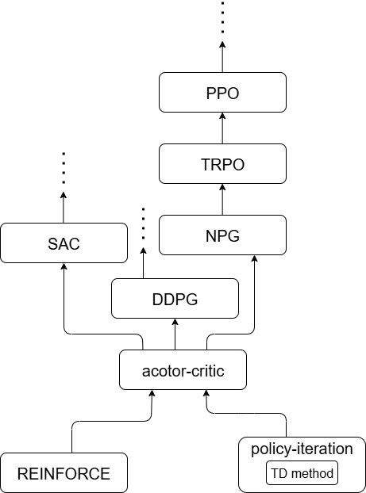
    <figcaption style="font-size: 0.8em; text-align: center; width: 200px; position: absolute; top: 102%; left: 15%;">
      RL Algorithms
    </figcaption>
  </figure>
  

  

    <figure style="position: absolute; top: 74.0%; left: 37%; width: 70px; text-align: center; z-index: 1;">
      
    </figure>
    

      <AnimatedArrow
        id="arrow1"
        :points="[
          [300, 520],
          [300, 530],
          [222, 530]
        ]"
        :stroke-width="4"
        color="#589EFB"
        :glass="true"
      />
    

    <figure style="position: absolute; top: 18%; left: 5%; width: 300px; text-align: center;">
      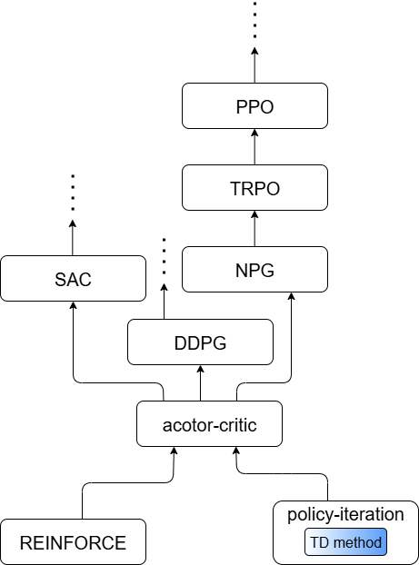
      <figcaption style="font-size: 0.8em; text-align: center; width: 200px; position: absolute; top: 102%; left: 15%;">
        RL Algorithms
      </figcaption>
    </figure>
    

    <strong>1. 提案手法</strong> 
      状態発展のモデルを用いずに, 状態発展の連続性を組み込んで学習できるTD法を提案した。

    <strong>2. 解析</strong> 
      状態発展が滑らかであるほど収束が速いことを示した。
    

  

  <figure style="position: absolute; top: 74.0%; left: 37%; width: 70px; text-align: center; z-index: 1;">
    
  </figure>
  

    <AnimatedArrow
      id="arrow1"
      :points="[
        [300, 520],
        [300, 530],
        [222, 530]
      ]"
      :stroke-width="4"
      color="#589EFB"
      :glass="true"
    />
  

  <figure style="position: absolute; top: 18%; left: 5%; width: 300px; text-align: center;">
    
    <figcaption style="font-size: 0.8em; text-align: center; width: 200px; position: absolute; top: 102%; left: 15%;">
      RL Algorithms
    </figcaption>
  </figure>
  

  <strong>1. 提案手法</strong> 
    状態発展のモデルを用いずに, 状態発展の連続性を組み込んで学習できるTD法(differential TD: dTD)を提案した。

  <strong>2. 解析</strong> 
    状態発展が滑らかであるほど収束が速いことを示した。
  

  

    <AnimatedArrow
      id="arrow2"
      :points="[
        [176, 520],
        [176, 476.8],
        [104.5, 476.8],
        [104.5, 457],
      ]"
      :stroke-width="4"
      color="#589EFB"
      :glass="true"
    />
  

  

    <AnimatedArrow
      id="arrow3"
      :points="[
        [104.5, 420],
        [104.5, 406],
        [147, 406],
        [147, 208]
      ]"
      :stroke-width="4"
      color="#589EFB"
      :glass="true"
    />
  

  

  <strong>3. 実験</strong> 
    連続系のベンチマークであるMujocoを用いて, 従来のTDに基づいたPPOと, 提案手法であるdTDに基づいたPPOを比較した。提案手法が学習効率を改善することを実験的に示した。 
  

  <figure style="position: absolute; top: 42%; left: 40%; width: 300px; text-align: center;">
    
    <figcaption style="font-size: 0.8em; white-space: nowrap;">
    brax simulator
    </figcaption>
  </figure>

---
layout: section
subject: Preliminaries on RL
---

# Preliminaries on RL

---
layout: two-cols
headerEnable: true
headerTitle: Preliminaries on RL
headerLogo: figures/utokyo.png
---

**TD method**

::left::

**Discrete**

  <figure style="position: absolute; top: 15%; right: 5%; width: 300px; text-align: center;">
    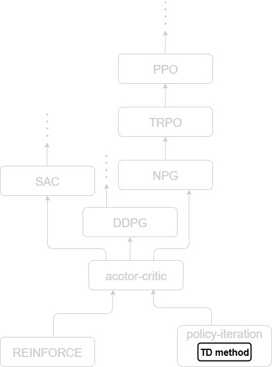
  </figure>
  

    

      

        

          

            

              

                

                  

                    

                      

                        

                          

                            

                              <v-click>
                                <figure style="position: relative; top: 0%; left: 0%; width: 220px; text-align: center;">
                                    
                                    <figcaption style="font-size: 0.8em; text-align: center; width: 200px; position: absolute; top: 102%; left: 0%;">
                                    MDP
                                    </figcaption>
                                </figure>
                              </v-click>
                            

                            

                              <figure style="position: relative; top: 0%; left: 0%; width: 220px; text-align: center;">
                                
                                <figcaption style="font-size: 0.8em; text-align: center; width: 200px; position: absolute; top: 102%; left: 0%;">
                                MDP
                                </figcaption>
                              </figure>
                            

                          

                          

                            <figure style="position: relative; top: 0%; left: 0%; width: 220px; text-align: center;">
                              
                              <figcaption style="font-size: 0.8em; text-align: center; width: 200px; position: absolute; top: 102%; left: 0%;">
                              MDP
                              </figcaption>
                            </figure>
                          

                        

                        

                          <figure style="position: relative; top: 0%; left: 0%; width: 220px; text-align: center;">
                            
                            <figcaption style="font-size: 0.8em; text-align: center; width: 200px; position: absolute; top: 102%; left: 0%;">
                            MDP
                            </figcaption>
                          </figure>
                        

                      

                      

                        <figure style="position: relative; top: 0%; left: 0%; width: 220px; text-align: center;">
                          
                          <figcaption style="font-size: 0.8em; text-align: center; width: 200px; position: absolute; top: 102%; left: 0%;">
                          MDP
                          </figcaption>
                        </figure>
                      

                    

                    

                      <figure style="position: relative; top: 0%; left: 0%; width: 220px; text-align: center;">
                        
                        <figcaption style="font-size: 0.8em; text-align: center; width: 200px; position: absolute; top: 102%; left: 0%;">
                        MDP
                        </figcaption>
                      </figure>
                    

                  

                  

                    <figure style="position: relative; top: 0%; left: 0%; width: 220px; text-align: center;">
                      
                      <figcaption style="font-size: 0.8em; text-align: center; width: 200px; position: absolute; top: 102%; left: 0%;">
                      MDP
                      </figcaption>
                    </figure>
                    <figure style="position: absolute; top: 39.4%; left: 26%; width: 150px; text-align: center;">
                      
                      <figcaption style="font-size: 0.8em; text-align: center; width: 200px; position: absolute; top: 120%; left: -15%;">
                      Model
                      </figcaption>
                    </figure>
                  

                

                

                  <figure style="position: relative; top: 0%; left: 0%; width: 220px; text-align: center;">
                    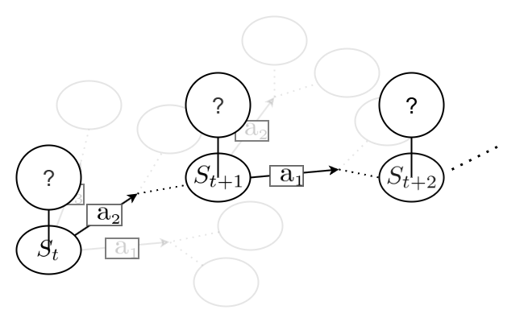
                    <figcaption style="font-size: 0.8em; text-align: center; width: 200px; position: absolute; top: 102%; left: 0%;">
                    MDP
                    </figcaption>
                  </figure>
                  <figure style="position: absolute; top: 39.4%; left: 26%; width: 150px; text-align: center;">
                    
                    <figcaption style="font-size: 0.8em; text-align: center; width: 200px; position: absolute; top: 120%; left: -15%;">
                    Model
                    </figcaption>
                  </figure>
                  <figure style="position: absolute; top: 61%; left: 14%; width: 80px; text-align: center;">
                    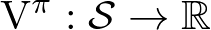
                    <figcaption style="font-size: 1.2em; position: absolute; top: -25%; left: -125%; font-size: 0.8em; white-space: nowrap;">
                    <strong>Value function:</strong>
                    </figcaption>
                  </figure>
                  

                    ←この関数(価値関数)を知りたい
                  

                

              

              

                <figure style="position: relative; top: 0%; left: 0%; width: 220px; text-align: center;">
                  
                  <figcaption style="font-size: 0.8em; text-align: center; width: 200px; position: absolute; top: 102%; left: 0%;">
                  MDP
                  </figcaption>
                </figure>
                <figure style="position: absolute; top: 39.4%; left: 26%; width: 150px; text-align: center;">
                  
                  <figcaption style="font-size: 0.8em; text-align: center; width: 200px; position: absolute; top: 120%; left: -15%;">
                  Model
                  </figcaption>
                </figure>
                <figure style="position: absolute; top: 61%; left: 14%; width: 80px; text-align: center;">
                  
                  <figcaption style="font-size: 1.2em; position: absolute; top: -25%; left: -125%; font-size: 0.8em; white-space: nowrap;">
                  <strong>Value function:</strong>
                  </figcaption>
                </figure>
                

                  ←この関数(価値関数)を知りたい
                

              

            

            

              <figure style="position: relative; top: 0%; left: 0%; width: 220px; text-align: center;">
                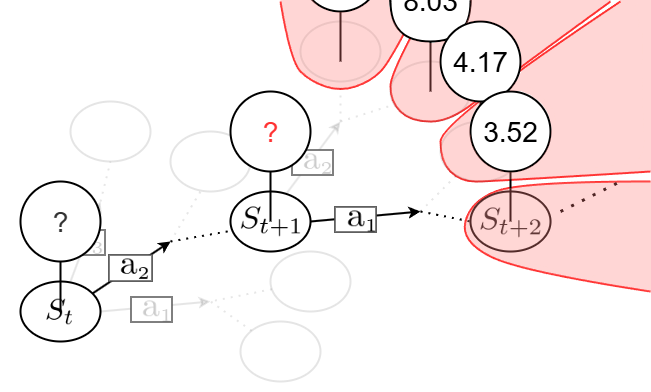
                <figcaption style="font-size: 0.8em; text-align: center; width: 200px; position: absolute; top: 102%; left: 0%;">
                MDP
                </figcaption>
              </figure>
              <figure style="position: absolute; top: 39.4%; left: 26%; width: 150px; text-align: center;">
                
                <figcaption style="font-size: 0.8em; text-align: center; width: 200px; position: absolute; top: 120%; left: -15%;">
                Model
                </figcaption>
              </figure>
              <figure style="position: absolute; top: 61%; left: 14%; width: 80px; text-align: center;">
                
                <figcaption style="font-size: 1.2em; position: absolute; top: -25%; left: -125%; font-size: 0.8em; white-space: nowrap;">
                <strong>Value function:</strong>
                </figcaption>
              </figure>
              

                ←この関数(価値関数)を知りたい
              

            

          

          

            <figure style="position: relative; top: 0%; left: 0%; width: 220px; text-align: center;">
              
              <figcaption style="font-size: 0.8em; text-align: center; width: 200px; position: absolute; top: 102%; left: 0%;">
              MDP
              </figcaption>
            </figure>
            <figure style="position: absolute; top: 39.4%; left: 26%; width: 150px; text-align: center;">
              
              <figcaption style="font-size: 0.8em; text-align: center; width: 200px; position: absolute; top: 120%; left: -15%;">
              Model
              </figcaption>
            </figure>
            <figure style="position: absolute; top: 61%; left: 14%; width: 80px; text-align: center;">
              
              <figcaption style="font-size: 1.2em; position: absolute; top: -25%; left: -125%; font-size: 0.8em; white-space: nowrap;">
              <strong>Value function:</strong>
              </figcaption>
            </figure>
            

              ←この関数(価値関数)を知りたい
            

          

        

        

          <figure style="position: relative; top: 0%; left: 0%; width: 220px; text-align: center;">
            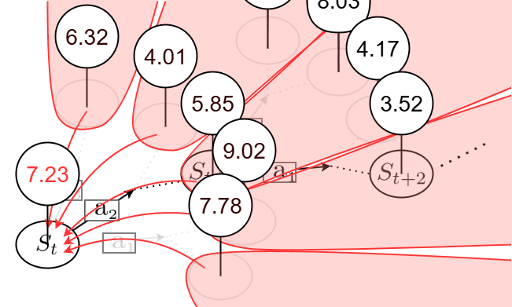
            <figcaption style="font-size: 0.8em; text-align: center; width: 200px; position: absolute; top: 102%; left: 0%;">
            MDP
            </figcaption>
          </figure>
          <figure style="position: absolute; top: 39.4%; left: 26%; width: 150px; text-align: center;">
            
            <figcaption style="font-size: 0.8em; text-align: center; width: 200px; position: absolute; top: 120%; left: -15%;">
            Model
            </figcaption>
          </figure>
          <figure style="position: absolute; top: 61%; left: 14%; width: 80px; text-align: center;">
            
            <figcaption style="font-size: 1.2em; position: absolute; top: -25%; left: -125%; font-size: 0.8em; white-space: nowrap;">
            <strong>Value function:</strong>
            </figcaption>
          </figure>
          

            ←この関数(価値関数)を知りたい
          

        

      

      

        <figure style="position: relative; top: 0%; left: 0%; width: 220px; text-align: center;">
          
          <figcaption style="font-size: 0.8em; text-align: center; width: 200px; position: absolute; top: 102%; left: 0%;">
          MDP
          </figcaption>
        </figure>
        <figure style="position: absolute; top: 39.4%; left: 26%; width: 150px; text-align: center;">
          
          <figcaption style="font-size: 0.8em; text-align: center; width: 200px; position: absolute; top: 120%; left: -15%;">
          Model
          </figcaption>
        </figure>
        <figure style="position: absolute; top: 61%; left: 14%; width: 80px; text-align: center;">
          
          <figcaption style="font-size: 1.2em; position: absolute; top: -25%; left: -125%; font-size: 0.8em; white-space: nowrap;">
          <strong>Value function:</strong>
          </figcaption>
        </figure>
        

          ←この関数(価値関数)を知りたい
        

        <figure style="position: absolute; top: 67%; left: 15.6%; width: 260px; text-align: center;">
          
          <figcaption style="font-size: 1.2em; position: absolute; top: -10%; left: -45%; font-size: 0.8em; white-space: nowrap;">
          <strong>Bellman equation:</strong>
          </figcaption>
        </figure>
        

          ←価値関数が満たすべき方程式(ベルマン方程式)
        

      

    

    

      <figure style="position: relative; top: 0%; left: 0%; width: 220px; text-align: center;">
        
        <figcaption style="font-size: 0.8em; text-align: center; width: 200px; position: absolute; top: 102%; left: 0%;">
        MDP
        </figcaption>
      </figure>
      <figure style="position: absolute; top: 39.4%; left: 26%; width: 150px; text-align: center;">
        
        <figcaption style="font-size: 0.8em; text-align: center; width: 200px; position: absolute; top: 120%; left: -15%;">
        Model
        </figcaption>
      </figure>
      <figure style="position: absolute; top: 61%; left: 14%; width: 80px; text-align: center;">
        
        <figcaption style="font-size: 1.2em; position: absolute; top: -25%; left: -125%; font-size: 0.8em; white-space: nowrap;">
        <strong>Value function:</strong>
        </figcaption>
      </figure>
      

        ←この関数(価値関数)を知りたい
      

      <figure style="position: absolute; top: 67%; left: 15.6%; width: 260px; text-align: center;">
        
        <figcaption style="font-size: 1.2em; position: absolute; top: -10%; left: -45%; font-size: 0.8em; white-space: nowrap;">
        <strong>Bellman equation:</strong>
        </figcaption>
      </figure>
      

        ←価値関数が満たすべき方程式(ベルマン方程式)
      

      <figure style="position: absolute; top: 72.5%; left: 13.8%; width: 320px; text-align: center;">
        
        <figcaption style="font-size: 1.2em; position: absolute; top: 18%; left: -32%; font-size: 0.8em; white-space: nowrap;">
        <strong>(True) TD Loss:</strong>
        </figcaption>
      </figure>
      

        ←Deep RLの真の目的関数
      

    

    <v-click>
      <figure style="position: absolute; top: 74.1%; left: 20.5%;">
        
      </figure>
      

        (モデル未知なので計算不可)
      

    </v-click>
  

  

    <figure style="position: relative; top: 0%; left: 0%; width: 220px; text-align: center;">
      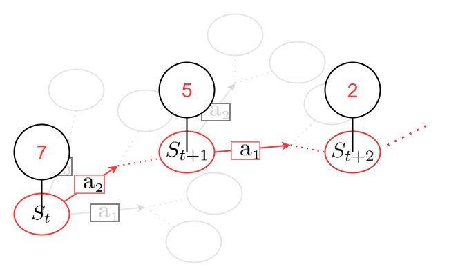
      <figcaption style="font-size: 0.8em; text-align: center; width: 200px; position: absolute; top: 102%; left: 0%;">
      MDP
      </figcaption>
    </figure>
    <figure style="position: absolute; top: 39.4%; left: 26%; width: 150px; text-align: center;">
      
      <figcaption style="font-size: 0.8em; text-align: center; width: 200px; position: absolute; top: 120%; left: -15%;">
      Model
      </figcaption>
    </figure>
    <figure style="position: absolute; top: 61%; left: 14%; width: 80px; text-align: center;">
      
      <figcaption style="font-size: 1.2em; position: absolute; top: -25%; left: -125%; font-size: 0.8em; white-space: nowrap;">
      <strong>Value function:</strong>
      </figcaption>
    </figure>
    

      ←この関数(価値関数)を知りたい
    

    <figure style="position: absolute; top: 67%; left: 15.6%; width: 260px; text-align: center;">
      
      <figcaption style="font-size: 1.2em; position: absolute; top: -10%; left: -45%; font-size: 0.8em; white-space: nowrap;">
      <strong>Bellman equation:</strong>
      </figcaption>
    </figure>
    

      ←価値関数が満たすべき方程式(ベルマン方程式)
    

    <figure style="position: absolute; top: 72.5%; left: 13.8%; width: 320px; text-align: center;">
      
      <figcaption style="font-size: 1.2em; position: absolute; top: 18%; left: -32%; font-size: 0.8em; white-space: nowrap;">
      <strong>(True) TD Loss:</strong>
      </figcaption>
    </figure>
    

      ←Deep RLの真の目的関数
    

    <figure style="position: absolute; top: 74.1%; left: 20.5%;">
      
    </figure>
    

      (モデル未知なので計算不可)
    

    <figure style="position: absolute; top: 80.0%; left: 10%; width: 270px; text-align: center;">
      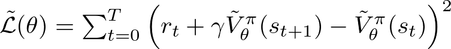
      <figcaption style="font-size: 1.2em; position: absolute; top: 17%; left: -23%; font-size: 0.8em; white-space: nowrap;">
      <strong>TD Loss:</strong>
      </figcaption>
    </figure>
    

      ←Deep RLの目的関数
    

  

  <figure style="position: relative; top: 0%; left: 0%; width: 220px; text-align: center;">
    
    <figcaption style="font-size: 0.8em; text-align: center; width: 200px; position: absolute; top: 102%; left: 0%;">
    MDP
    </figcaption>
  </figure>
  <figure style="position: absolute; top: 39.4%; left: 26%; width: 150px; text-align: center;">
    
    <figcaption style="font-size: 0.8em; text-align: center; width: 200px; position: absolute; top: 120%; left: -15%;">
    Model
    </figcaption>
  </figure>

  <figure style="position: absolute; top: 61%; left: 14%; width: 80px; text-align: center;">
    
    <figcaption style="font-size: 1.2em; position: absolute; top: -25%; left: -125%; font-size: 0.8em; white-space: nowrap;">
    <strong>Value function:</strong>
    </figcaption>
  </figure>

  <figure style="position: absolute; top: 67%; left: 15.6%; width: 260px; text-align: center;">
    
    <figcaption style="font-size: 1.2em; position: absolute; top: -10%; left: -45%; font-size: 0.8em; white-space: nowrap;">
    <strong>Bellman equation:</strong>
    </figcaption>
  </figure>

  <figure style="position: absolute; top: 72.5%; left: 13.8%; width: 320px; text-align: center;">
    
    <figcaption style="font-size: 1.2em; position: absolute; top: 18%; left: -32%; font-size: 0.8em; white-space: nowrap;">
    <strong>(True) TD Loss:</strong>
    </figcaption>
  </figure>

  <figure style="position: absolute; top: 80.0%; left: 10%; width: 270px; text-align: center;">
    
    <figcaption style="font-size: 1.2em; position: absolute; top: 17%; left: -23%; font-size: 0.8em; white-space: nowrap;">
    <strong>TD Loss:</strong>
    </figcaption>
  </figure>

::right::

**Continuous**

<v-click>
<figure style="position: relative; top: 0%; left: 3%; width: 185px; text-align: center;">
  
  <figcaption style="font-size: 0.8em; text-align: center; width: 200px; position: absolute; top: 102%; left: 0%;">
  Continuous MDP
  </figcaption>
</figure>
<figure style="position: absolute; top: 35%; left: 75%; width: 150px; text-align: center;">
  
  <figcaption style="font-size: 0.8em; text-align: center; width: 200px; position: absolute; top: 120%; left: -18%;">
  Model
  </figcaption>
</figure>
<figure style="position: absolute; top: 42%; left: 82%; width: 10px; text-align: center;">
  
</figure>
<figure style="position: absolute; top: 48%; left: 78%; width: 90px; text-align: center;">
  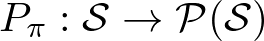
  <figcaption style="font-size: 0.8em; text-align: center; width: 200px; position: absolute; top: 120%; left: -60%;">
  Model (another expression)
  </figcaption>
</figure>

<figure style="position: absolute; top: 61%; left: 62%; width: 80px; text-align: center;">
  
  <figcaption style="font-size: 1.2em; position: absolute; top: -25%; left: -125%; font-size: 0.8em; white-space: nowrap;">
  <strong>Value function:</strong>
  </figcaption>
</figure>

<figure style="position: absolute; top: 67%; left: 63.8%; width: 295px; text-align: center;">
  
  <figcaption style="font-size: 1.2em; position: absolute; top: -12%; left: -40%; font-size: 0.8em; white-space: nowrap;">
  <strong>Bellman equation:</strong>
  </figcaption>
</figure>

<figure style="position: absolute; top: 72.5%; left: 61.8%; width: 360px; text-align: center;">
  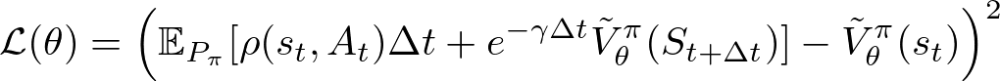
  <figcaption style="font-size: 1.2em; position: absolute; top: 19%; left: -28%; font-size: 0.8em; white-space: nowrap;">
  <strong>(True) TD Loss:</strong>
  </figcaption>
</figure>

<figure style="position: absolute; top: 80.0%; left: 58%; width: 310px; text-align: center;">
  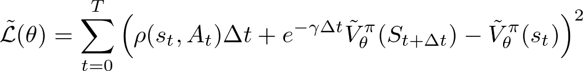
  <figcaption style="font-size: 1.2em; position: absolute; top: 17%; left: -20%; font-size: 0.8em; white-space: nowrap;">
  <strong>TD Loss:</strong>
  </figcaption>
</figure>
</v-click>

<v-click>
  <figure style="position: absolute; bottom: 13%; left: 15.5%">
    
  </figure>
  <figure style="position: absolute; bottom: 13.5%; left: 63.5%;">
    
  </figure>
  

     系が連続だとわかっていても更新則にその情報が組み込まれていないため, 強化学習Agentは自分がいる系が離散か連続かわからない。
  

</v-click>

---
layout: section
subject: Our Approach
---

# Our Approach

---
layout: two-cols
headerEnable: true
headerTitle: Our Approach - Method
headerLogo: figures/utokyo.png
---

## Core Idea

::left::

**Discrete**

<figure style="position: relative; top: 0%; left: 0%; width: 220px; text-align: center;">
  
  <figcaption style="font-size: 0.8em; text-align: center; width: 200px; position: absolute; top: 102%; left: 0%;">
  MDP
  </figcaption>
</figure>
<figure style="position: absolute; top: 39.4%; left: 26%; width: 150px; text-align: center;">
  
  <figcaption style="font-size: 0.8em; text-align: center; width: 200px; position: absolute; top: 120%; left: -15%;">
  Model
  </figcaption>
</figure>

<figure style="position: absolute; top: 61%; left: 13.8%; width: 320px; text-align: center;">
  
  <figcaption style="font-size: 1.2em; position: absolute; top: 18%; left: -32%; font-size: 0.8em; white-space: nowrap;">
  <strong>(True) TD Loss:</strong>
  </figcaption>
</figure>

<figure style="position: absolute; top: 73%; left: 10%; width: 270px; text-align: center;">
  
  <figcaption style="font-size: 1.2em; position: absolute; top: 17%; left: -23%; font-size: 0.8em; white-space: nowrap;">
  <strong>TD Loss:</strong>
  </figcaption>
</figure>

<v-click>
  <figure style="position: absolute; top: 54.9%; left: 21.1%;">
    
  </figure>
  <figure style="position: absolute; top: 62.5%; left: 20.5%;">
    
  </figure>

  <figure style="position: absolute; top: 51.9%; left: 68.9%;">
    
  </figure>
  <figure style="position: absolute; top: 62.6%; left: 68.3%;">
    
  </figure>
</v-click>

::right::

**Continuous**

<figure style="position: relative; top: 0%; left: 3%; width: 185px; text-align: center;">
  
  <figcaption style="font-size: 0.8em; text-align: center; width: 200px; position: absolute; top: 102%; left: 0%;">
  Continuous MDP
  </figcaption>
</figure>
<figure style="position: absolute; top: 35%; left: 75%; width: 150px; text-align: center;">
  
  <figcaption style="font-size: 0.8em; text-align: center; width: 200px; position: absolute; top: 120%; left: -18%;">
  Model
  </figcaption>
</figure>
<figure style="position: absolute; top: 43%; left: 82%; width: 10px; text-align: center;">
  
</figure>
<figure style="position: absolute; top: 48%; left: 78%; width: 90px; text-align: center;">
  
  <figcaption style="font-size: 0.8em; text-align: center; width: 200px; position: absolute; top: 120%; left: -60%;">
  Model (another expression)
  </figcaption>
</figure>

<figure style="position: absolute; top: 61%; left: 61.8%; width: 360px; text-align: center;">
  
  <figcaption style="font-size: 1.2em; position: absolute; top: 19%; left: -28%; font-size: 0.8em; white-space: nowrap;">
  <strong>(True) TD Loss:</strong>
  </figcaption>
</figure>

<figure style="position: absolute; top: 73%; left: 58%; width: 310px; text-align: center;">
  
  <figcaption style="font-size: 1.2em; position: absolute; top: 17%; left: -20%; font-size: 0.8em; white-space: nowrap;">
  <strong>TD Loss:</strong>
  </figcaption>
</figure>

<v-click>
  <v-click>
    <figure style="position: absolute; top: 66.4%; left: 68.4%;">
      
    </figure>
  </v-click>
</v-click>

<v-click>
  <figure style="position: absolute; top: 56%; left: 70%;">
    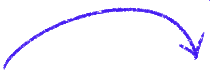
  </figure>
</v-click>

<v-click>
  <figure style="position: absolute; top: 65.4%; left: 79.1%;">
    
  </figure>
  

     Embed the model into the   sample based loss
  

  

     モデルを期待値の添え字 だけでなく引数にも組み込むことで真の目的関数をサンプル近似した後でもモデルの連続性の情報が残るようにする。
  

</v-click>

---
layout: default
headerEnable: true
headerTitle: Our Approach - Method
headerLogo: figures/utokyo.png
---

## Embedding the model introduces another problem

$$
\begin{aligned}
V^\pi(s_t) &= \mathbb{E}_{P_\pi}\left[\rho(s_t, A_t)\Delta t+e^{-\gamma\Delta t}V^\pi(S_{t+\Delta t})\right] \\
\end{aligned}
$$

<v-click>
  <figure style="position: absolute; top: 27.2%; left: 33.3%">
    
  </figure>
  

      Embed the model here,   i.e., expand this term using:
  

  

$$
\begin{aligned}
dS_t &= \mu(S_t, A_t)dt+\sigma(S_t, A_t)dB_t \\
\end{aligned}
$$

</v-click>

<v-click>

$$
\begin{aligned}
\Longrightarrow V^\pi(s_t) &= \frac{1}{\gamma}\mathbb{E}_{P_\pi}\left[\rho(s_t, A_t)+\sum_{i=1}^{n} \mu^i(s_t, A_t)\frac{\partial V^{\pi}(s)}{\partial s^i} \bigg|_{s_t}+ \frac{1}{2} \sum_{i=1}^{n} \sum_{j=1}^{n}[\sigma(s_t, A_t)\sigma^\top(s_t, A_t)]^{ij}\frac{\partial^2 V^{\pi}(s)}{\partial s^i \partial s^j}\bigg|_{s_t}\right]
\end{aligned}
$$

</v-click>

<v-click>

$$
\begin{aligned}
\text{(True) TD Loss: } \mathcal{L}(\theta) &= \left(\frac{1}{\gamma}\mathbb{E}_{P_\pi}\left[\rho(s_t, A_t)+\sum_{i=1}^{n} \mu^i(s_t, A_t)\frac{\partial \tilde{V}_\theta^{\pi}(s)}{\partial s^i} \bigg|_{s_t}+ \frac{1}{2} \sum_{i=1}^{n} \sum_{j=1}^{n}[\sigma(s_t, A_t)\sigma^\top(s_t, A_t)]^{ij}\frac{\partial^2 \tilde{V}_\theta^{\pi}(s)}{\partial s^i \partial s^j}\bigg|_{s_t}\right] - \tilde{V}_\theta^\pi(s_t)\right)^2, \\
\text{TD Loss: } \tilde{\mathcal{L}}(\theta) &= \left(\frac{1}{\gamma}\left(\rho(s_t, A_t)+\sum_{i=1}^{n} \mu^i(s_t, A_t)\frac{\partial \tilde{V}_\theta^{\pi}(s)}{\partial s^i} \bigg|_{s_t}+ \frac{1}{2} \sum_{i=1}^{n} \sum_{j=1}^{n}[\sigma(s_t, A_t)\sigma^\top(s_t, A_t)]^{ij}\frac{\partial^2 \tilde{V}_\theta^{\pi}(s)}{\partial s^i \partial s^j}\bigg|_{s_t}\right) - \tilde{V}_\theta^\pi(s_t)\right)^2
\end{aligned}
$$

</v-click>

<v-click>
<figure style="position: absolute; top: 74%; left: 35%">
  
</figure>

モデルを埋め込むことはできたが, 目的関数にモデルが現れるようになるため, このままだとモデルを知らないと学習できない。

</v-click>

<v-click>

$$
\begin{aligned}
V^\pi(s_t) &= \frac{1}{\gamma}\mathbb{E}_{P_\pi}\left[\text{entirely computable from trajectories}\right]
\end{aligned}
$$

</v-click>

---
layout: default
headerEnable: true
headerTitle: Our Approach - Method
headerLogo: figures/utokyo.png
---

## Main result1

モデルの推定に必要な普遍推定量を見つけたことで, 連続性を埋め込んだ目的関数をサンプルのみから学習できるようになった。

$$
\begin{aligned}
\mathbb E_{P_{\pi}}\left[\mu^i(s_t, A_t)\right] &= \underset{\Delta t\rightarrow 0}{\lim}\mathbb E_{P_{\pi}}\left[\frac{S_{t+\Delta t}^i-s_t^i}{\Delta t}\right] \\
\mathbb E_{P_{\pi}}\left[[\sigma(s_t, A_t)\sigma^\top(s_t, A_t)]^{ij}\right] &= \underset{\Delta t\rightarrow 0}{\lim}\mathbb E_{P_{\pi}}\left[\frac{(S_{t+\Delta t}^i - s_{t}^i)(S_{t+\Delta t}^j - s_{t}^j)}{\Delta t}\right]
\end{aligned}
$$

  

<v-click>

$$
\begin{aligned}
\mathcal{L}(\theta) &\ \ \ = \left(\frac{1}{\gamma}\mathbb{E}_{P_\pi}\left[\rho(s_t, A_t)+\sum_{i=1}^{n} \mu^i(s_t, A_t)\frac{\partial \tilde{V}_\theta^{\pi}(s)}{\partial s^i} \bigg|_{s_t}+ \frac{1}{2} \sum_{i=1}^{n} \sum_{j=1}^{n}[\sigma(s_t, A_t)\sigma^\top(s_t, A_t)]^{ij}\frac{\partial^2 \tilde{V}_\theta^{\pi}(s)}{\partial s^i \partial s^j}\bigg|_{s_t}\right] - \tilde{V}_\theta^\pi(s_t)\right)^2 \\
&\overset{\begin{array}{c}\scriptsize \text{Main} \\ \scriptsize \text{result}\end{array}}{=} \left(\frac{1}{\gamma}\underset{\Delta t\rightarrow 0}{\lim}\mathbb{E}_{P_\pi}\left[\rho(s_t, A_t)+\sum_{i=1}^{n} \frac{S_{t+\Delta t}^i-s_t^i}{\Delta t}\frac{\partial \tilde{V}_\theta^{\pi}(s)}{\partial s^i} \bigg|_{s_t}+ \frac{1}{2} \sum_{i=1}^{n} \sum_{j=1}^{n}\frac{(S_{t+\Delta t}^i - s_{t}^i)(S_{t+\Delta t}^j - s_{t}^j)}{\Delta t}\frac{\partial^2 \tilde{V}_\theta^{\pi}(s)}{\partial s^i \partial s^j}\bigg|_{s_t}\right] - \tilde{V}_\theta^\pi(s_t)\right)^2 \\
\Longrightarrow\tilde{\mathcal{L}}(\theta) &\overset{\begin{array}{c}\scriptsize \text{for sufficiently} \\ \scriptsize \text{small }\Delta t > 0\end{array}}{\approx} \left(\frac{1}{\gamma}\left(\rho(s_t, A_t)+\sum_{i=1}^{n} \frac{s_{t+\Delta t}^i-s_t^i}{\Delta t}\frac{\partial \tilde{V}_\theta^{\pi}(s)}{\partial s^i} \bigg|_{s_t}+ \frac{1}{2} \sum_{i=1}^{n} \sum_{j=1}^{n}\frac{(s_{t+\Delta t}^i - s_{t}^i)(s_{t+\Delta t}^j - s_{t}^j)}{\Delta t}\frac{\partial^2 \tilde{V}_\theta^{\pi}(s)}{\partial s^i \partial s^j}\bigg|_{s_t}\right) - \tilde{V}_\theta^\pi(s_t)\right)^2
\end{aligned}
$$

</v-click>

---
layout: default
headerEnable: true
headerTitle: Our Approach - Method
headerLogo: figures/utokyo.png
---

## Interpretation

**Classical TD Loss:**

$\tilde{\mathcal{L}}(\theta)=\sum_{t=1}^{T}(\rho\Delta t + e^{-\gamma\Delta t}V_\theta(s_{t+1})-V_\theta(s_t))^2$

**Proposed TD Loss:**

$\tilde{\mathcal{L}}(\theta) = \sum_{t=1}^{T}\small{\left(\frac{1}{\gamma}\left(\rho(s_t, A_t)+\sum_{i=1}^{n} \frac{s_{t+\Delta t}^i-s_t^i}{\Delta t}\frac{\partial \tilde{V}_\theta^{\pi}(s)}{\partial s^i} \bigg|_{s_t}+ \frac{1}{2} \sum_{i=1}^{n} \sum_{j=1}^{n}\frac{(s_{t+\Delta t}^i - s_{t}^i)(s_{t+\Delta t}^j - s_{t}^j)}{\Delta t}\frac{\partial^2 \tilde{V}_\theta^{\pi}(s)}{\partial s^i \partial s^j}\bigg|_{s_t}\right) - \tilde{V}_\theta^\pi(s_t)\right)^2}$

<figure style="position: absolute; top: 58%; left: 15%">
  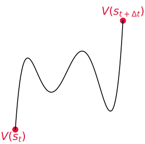
  <figcaption style="font-size: 1.2em; position: absolute; top: 100%; left: 10%; font-size: 0.8em; white-space: nowrap;">
  <strong>Classical TD Loss</strong>
  </figcaption>
</figure>

<figure style="position: absolute; top: 58.9%; left: 35%">
  
  <figcaption style="font-size: 1.2em; position: absolute; top: 100%; left: 10%; font-size: 0.8em; white-space: nowrap;">
  <strong>Proposed TD Loss</strong>
  </figcaption>
</figure>

<strong>従来のTDと提案したdTDの定性的な違い;</strong>
それぞれの手法は図の赤い部分を見てパラメータを調整する。TDの目的関数はVの値 を使って最適化する一方で, dTDはVの勾配とヘッシアンを使って最適化を行うため, 価値関数が滑らかになるような作用がある。

---
layout: default
headerEnable: true
headerTitle: Our Approach - Analysis
headerLogo: figures/utokyo.png
---

## Convergence Analysis(Main result2)

**Classical TD:**
$$\begin{aligned}&V_{i+1}^\pi(s_t) = (TV_{i})(s_t):=\mathbb{E}_{P_\pi}\left[r(s_t, A_t)+\gamma V_i^\pi(S_{t+1})\right] \\ &\|TV^\pi-TU^\pi\|_\infty\leq\gamma\|V^\pi-U^\pi\|_\infty\:(0<\gamma<1)\end{aligned}$$

**dTD:**
$$\begin{aligned}&V_{i+1}^\pi(s_t) = (\tilde{T}V_{i})(s_t):=\frac{1}{\gamma}\mathbb{E}_{P_\pi}\left[\rho(s_t, A_t)+\sum_{i=1}^{n} \mu^i(s_t, A_t)\frac{\partial V_i^{\pi}(s)}{\partial s^i} \bigg|_{s_t}+ \frac{1}{2} \sum_{i=1}^{n} \sum_{j=1}^{n}[\sigma(s_t, A_t)\sigma^\top(s_t, A_t)]^{ij}\frac{\partial^2 V_i^{\pi}(s)}{\partial s^i \partial s^j}\bigg|_{s_t}\right] \\ &\|\tilde{T}V^\pi-\tilde{T}U^\pi\|_{H^{-1}(S)}\leq\frac{1}{\gamma}\left(\sum_{i=1}^2\|\nabla^i\mu\|_{L^\infty}+\sum_{i=1}^3\|\nabla^i\sigma\|_{L^\infty}\right)\|V^\pi-U^\pi\|_{H^{-1}(S)}\:(0<\gamma<\infty)\end{aligned}$$

**(Efficient Computation)**

$$\left\langle\Delta s_t, \frac{\partial^2 V}{\partial s^2}\bigg|_{s_t}\Delta s_t\right\rangle=\left\langle\Delta s_t, \frac{\partial}{\partial s}\left\langle\frac{\partial V}{\partial s},\Delta s_t\right\rangle\bigg|_{s_t}\right\rangle$$

<figure style="position: relative; top: -90%; left: 80%; width: 120px; text-align: center;">
    
</figure>

---
layout: default
headerEnable: true
headerTitle: Our Approach - Experiment
headerLogo: figures/utokyo.png
---

## Experimental Design

<figure style="position: absolute; top: 22%; left: 10%">
  
</figure>

<figure style="position: absolute; top: 15%; left: 27%">
  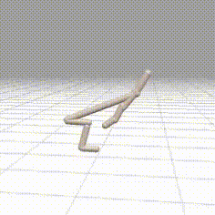
</figure>

<figure style="position: absolute; top: 15%; left: 44%">
  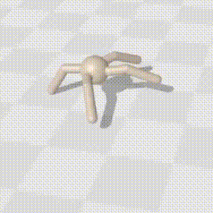
</figure>

<figure style="position: absolute; top: 15%; left: 61%">
  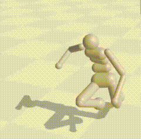
</figure>

<figure style="position: absolute; top: 50%; left: 50%">
  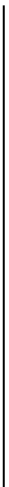
</figure>

<v-click>

  <strong>Modification for discrete environment compatibility</strong>

$$
\begin{aligned}
&\int_{0}^\infty \text{e}^{-\gamma t}\rho(s_t, a_t)dt\approx \sum_{k=0}^\infty \text{e}^{(-\gamma\Delta t)k}\rho(s_{k\Delta t}, a_{k\Delta t})\Delta t \\
&\Longrightarrow \rho(s_t, a_t)=\frac{r(s_t, a_t)}{\Delta t}\text{ and }\rho(s_t, a_t)=-\frac{1}{\Delta t}\log{(\gamma_{\text{discrete}})}
\end{aligned}
$$

</v-click>

<v-click>

  <strong>Add noise to mimic stochastic environment</strong>

$$
\begin{aligned}
&\mathbf{s}_i\leftarrow \mathbf{s}_i + \nu |\mathbf{s}_i|\times\text{noise}\\
&\nu\in\{0.0, 0.01, 0.05\},\:\text{noise}\sim\mathcal{N}(0,1)
\end{aligned}
$$

</v-click>

---
layout: default
headerEnable: true
headerTitle: Our Approach - Experiment
headerLogo: figures/utokyo.png
---

## Results

<figure style="position: absolute; top: 20%; left: 30%">
  
</figure>

<figure style="position: absolute; top: 38%; left: 21%">
  
</figure>

<figure style="position: absolute; top: 54.8%; left: 21%">
  
</figure>

<figure style="position: absolute; top: 71.6%; left: 21%">
  
</figure>

---
layout: default
headerEnable: true
headerTitle: Summary
headerLogo: figures/utokyo.png
---

## Summary

- 確率最適制御がターゲットとするHJB方程式(ベルマン方程式の連続版)をモデルフリーで学習する強化学習手法を提案した。モデルを知らなくてもモデルの連続性を活用して学習することが可能。
- 理想的な行進ではダイナミクスが滑らかであるほど収束が速いことを示した。
- ロボットのような工学的な応用だけでなく, 近年研究されている確率最適制御を用いたDiffusion Modelのチューニング[1][2]などにも利用可能(現在の手法はbackward processをモデル化するため余計にモデルを学習しているがこの過程を無くせる)。

[1] Masatoshi Uehara et al.(2024) Understanding Reinforcement Learning-Based Fine-Tuning of Diffusion Models: A Tutorial and Review. arXiv:2407.13734, 2024. 
[2] Wenpin Tang.(2024) Fine-tuning of diffusion models via stochastic control: entropy regularization and beyond. arXiv:2403.06279, 2024.

---
layout: section
subject: 研究計画
---

# 博士課程の研究計画

---
layout: default
headerEnable: true
headerTitle: 研究計画
headerLogo: figures/utokyo.png
---

**研究概要**

強化学習のNNを用いた関数近似による汎化能力(未知の入力にも正しい出力を行う能力)の研究を行う。

**汎化誤差解析**
<figure style="position: absolute; top: 35%; left: 7%; width: 600px;">
  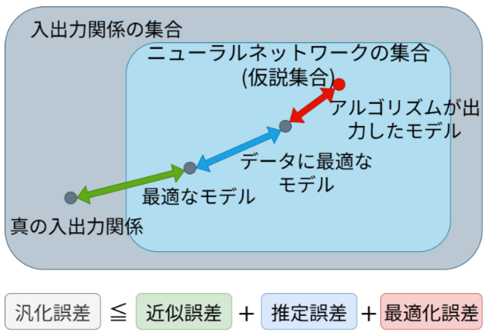
</figure>
<figure style="position: absolute; top: 35%; left: 55%; width: 600px;">
  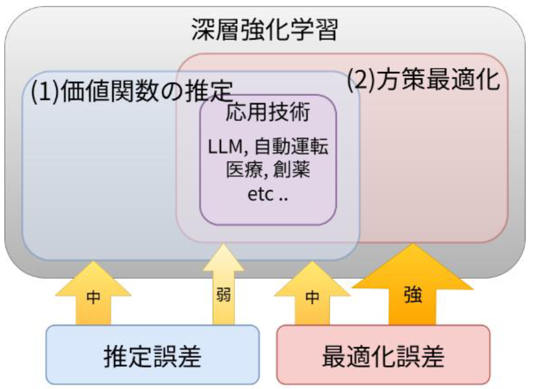
</figure>

---
layout: default
headerEnable: true
headerTitle: 研究計画
headerLogo: figures/utokyo.png
---

**当該分野の現状の課題**

<figure style="position: absolute; top: 25%; left: 3%; width: 600px;">
  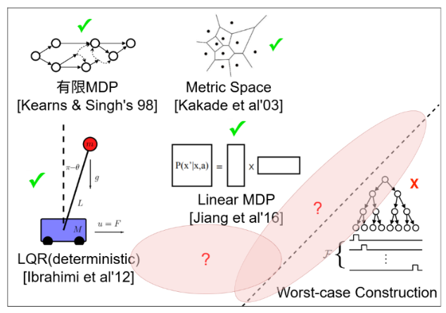
</figure>

- 図右下のように, MDPに何の構造も仮定しなければ汎化が不可能な例を構成することができる。教師あり学習のように仮説集合の大きさを制御しても, 報酬という局所的な要素があるためこのような例が構成できる。 
- 状態空間のサイズが有限であれば汎化可能(図右上) 
- 状態遷移, 報酬, 関数近似器のすべてに線型性を仮定すれば汎化可能。 
- 状態空間は無限だが, 潜在的に有限の状態空間を仮定するBlock MDPという構造も存在する。この制約の下では非線形関数近似で汎化可能。
- 近年, 教師あり学習の汎化誤差解析で研究されている平均場理論をもちいた深層強化学習の解析も存在するが, 状態空間のサイズが有限であることを要請したり, 価値関数に制約を課しており, 具体的にどのようなMDPを構成すれば汎化可能なのかは明らかになっていない。

以上の課題を踏まえ、本研究では以下を目標とする：
- 状態空間のサイズ無限
- 非線形関数近似に対応する, できるだけ緩いMDPの構造を明らかにする
- 明らかにしたMDPに対して最適な探索を考える
- (1)価値関数の推定と(2)方策の最適化を統一的に解析する

---
layout: default
headerEnable: true
headerTitle: 研究計画
headerLogo: figures/utokyo.png
---

**年次計画**

**1年目** 
**前半:** **価値関数の推定において汎化可能な状態遷移の構造を明らかにする。** 非線形関数近似を用いた解析では状態サイズが本質的に有限であることを要求するため, 無限と有限をつなぐ解析の道具を使うことや, それが無理であればLQRを拡張したControlled Diffusion(修士の研究対象)を仮定する。 
**後半:** **方策最適化の汎化誤差の上限の導出をおこなう。** 現在, 方策最適化は自然勾配法を用いた線形関数近似のもとでは状態空間のサイズに依存せずに大域的最適解に収束することがわかっている。自然勾配法のどのような性質が状態空間のサイズに依存しない解析を可能にするのかを理解し, 平均場理論と組み合わせて解析を行うことを想定している 

**2年目** 
**前半:** 1年目前半と後半の成果を組み合わせて価値関数の推定が要求するMDPの構造の下で方策最適化の汎化誤差解析を行う。 
**後半:** 2年目前半で得られた結果を用いて価値関数の推定の汎化誤差解析を行い, 価値関数の推定と方策最適化を統一的に解析する。 

**3年目** 
2年目までに得られたMDPの構造の下での効率的な探索や応用研究を行う。

---
layout: section
subject: Thank you
hideInToc: true
---
